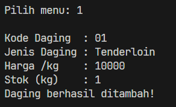
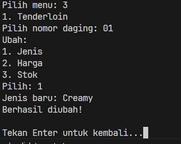
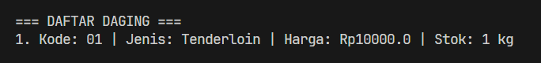

Sistem Manajemen Toko Daging Meatlove Posttest 1

Deskripsi
Sistem Manajemen Meatlove adalah sebauah sistem ang ditulis menggunakan bahasa pemrograman Java dimana program ini dirancang untuk memenuhi tugas Posttest 1 Praktikum Pemrograman Berorientasi Objek (PBO). 
Sistem ini memfasilitasi pengguna untuk melakukan manajemen data inventaris daging dan data pelanggan dengan mudah.

## Fitur Program
Program ini mengimplementasikan konsep operasi dasar CRUD (Create, Read, Update, Delete) menggunakan tipe data koleksi `ArrayList` untuk menyimpan objek secara dinamis di dalam memori saat program berjalan. 

Sistem ini memiliki menu utama sebagai berikut:

**Manajemen Daging**
* `1. Tambah Daging` : Memasukkan data daging baru (Kode, Jenis, Harga per kg, dan Stok dalam kg).
* `2. Lihat Daging` : Menampilkan daftar lengkap data daging yang telah diinputkan.
* `3. Ubah Daging` : Memperbarui rincian data daging tertentu (bisa mengubah Jenis, Harga, atau Stok).
* `4. Hapus Daging` : Menghapus data daging dari dalam sistem.

**Manajemen Pelanggan**
* `5. Tambah Pelanggan` : Memasukkan data pelanggan/restoran baru (ID, Nama Usaha, dan Alamat Lengkap).
* `6. Lihat Pelanggan` : Menampilkan daftar semua pelanggan yang sudah didaftarkan.
* `7. Ubah Pelanggan` : Memperbarui informasi data pelanggan (bisa mengubah Nama Usaha atau Alamat).
* `8. Hapus Pelanggan` : Menghapus data pelanggan dari sistem.

## Struktur File dan Penjelasan Kode
Proyek ini dibagi menjadi 3 kelas utama:

**1. `Daging.java`**

| Atribut | Tipe | Keterangan |
| :--- | :--- | :--- |
| `kodeDaging` | `String` | Kode unik pendataan daging |
| `jenisDaging` | `String` | Nama atau jenis daging yang dijual |
| `harga` | `double` | Harga daging per kilogram |
| `stok` | `int` | Jumlah stok daging yang tersedia (dalam kg) |

 

**2. `Pelanggan.java`**

| Atribut | Tipe | Keterangan |
| :--- | :--- | :--- |
| `idPelanggan` | `String` | ID unik pelanggan atau restoran |
| `namaUsaha` | `String` | Nama usaha atau nama restoran pelanggan |
| `alamat` | `String` | Alamat lengkap dari pelanggan |

 

**3. `main.java`**

Merupakan kelas utama yang menjadi inti tempat berjalannya program.

## Prasyarat
Pastikan Java Development Kit (JDK) telah terinstal pada sistem komputer Anda untuk dapat mengompilasi dan menjalankan program ini.

## Cara Menjalankan Program
1. Buka *Terminal* atau *Command Prompt*.
2. Navigasikan ke direktori folder tempat kode program ini disimpan.
3. Lakukan kompilasi program java.

## Output kode
1. Menu awal
   
   

2. Menu Tambah

   

3. Menu Edit

   

4. Menu Hapus

   

5. Menu Lihat

   
   
