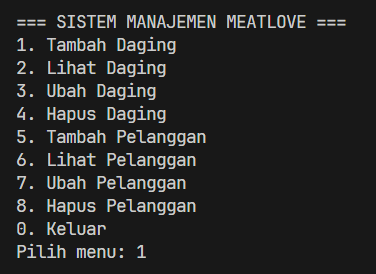
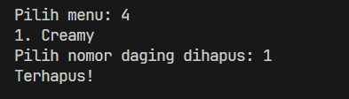

## Sistem Manajemen Toko Daging Meatlove

Deskripsi
Sistem Manajemen Meatlove adalah sebuah program berbasis CLI (Command Line Interface) yang ditulis menggunakan bahasa pemrograman Java untuk memenuhi tugas Praktikum Pemrograman Berorientasi Objek (PBO). 
Sistem ini memfasilitasi pengguna untuk melakukan manajemen data inventaris daging, pelanggan, serta data pegawai. Program ini telah mengimplementasikan konsep OOP seperti Encapsulation, penggunaan Access Modifier, dan Hierarchical Inheritance.

## Fitur Program
Program ini mengimplementasikan konsep operasi dasar CRUD (Create, Read, Update, Delete) menggunakan tipe data koleksi `ArrayList` untuk menyimpan objek secara dinamis di dalam memori saat program berjalan. 

Sistem ini memiliki menu utama sebagai berikut:

**Manajemen Daging**
* `1. Tambah Daging` : Memasukkan data daging baru (Kode, Jenis, Harga per kg, dan Stok dalam kg).
* `2. Lihat Daging` : Menampilkan daftar lengkap data daging yang telah diinputkan.
* `3. Ubah Daging` : Memperbarui rincian data daging tertentu.
* `4. Hapus Daging` : Menghapus data daging dari dalam sistem.

**Manajemen Pelanggan**
* `5. Tambah Pelanggan` : Memasukkan data pelanggan/restoran baru (ID, Nama Usaha, dan Alamat Lengkap).
* `6. Lihat Pelanggan` : Menampilkan daftar semua pelanggan yang sudah didaftarkan.
* `7. Ubah Pelanggan` : Memperbarui informasi data pelanggan.
* `8. Hapus Pelanggan` : Menghapus data pelanggan dari sistem.

**Manajemen Pegawai (Penerapan Inheritance)**
* `9. Tambah Pegawai` : Memasukkan data pegawai baru berdasarkan spesifikasi jabatan (Kasir, Pemotong Daging, Kurir).
* `10. Lihat Pegawai` : Menampilkan daftar pegawai beserta atribut bawaan dan atribut spesifik dari subclass.
* `11. Ubah Pegawai` : Memperbarui data gaji pegawai.
* `12. Hapus Pegawai` : Menghapus data pegawai dari sistem.

## Struktur File dan Penjelasan Kode
Proyek ini memisahkan model data ke dalam *package* `com.core` dan dibagi menjadi beberapa kelas utama:

**1. `Daging.java`**

| Atribut | Tipe | Keterangan |
| :--- | :--- | :--- |
| `kodeDaging` | `String` | Kode unik pendataan daging |
| `jenisDaging` | `String` | Nama atau jenis daging yang dijual |
| `harga` | `double` | Harga daging per kilogram |
| `stok` | `int` | Jumlah stok daging yang tersedia (dalam kg) |

 

**2. `Pelanggan.java`**

| Atribut | Tipe | Keterangan |
| :--- | :--- | :--- |
| `idPelanggan` | `String` | ID unik pelanggan atau restoran |
| `namaUsaha` | `String` | Nama usaha atau nama restoran pelanggan |
| `alamat` | `String` | Alamat lengkap dari pelanggan |

 

**3. `Pegawai.java` (Superclass)**

Merupakan kelas induk yang mendemonstrasikan penggunaan 4 jenis *Access Modifier*.

| Atribut | Tipe | Modifier | Keterangan |
| :--- | :--- | :--- | :--- |
| `idPegawai` | `String` | `private` | ID unik pegawai |
| `namaPegawai` | `String` | `public` | Nama lengkap pegawai |
| `gaji` | `double` | `protected` | Besaran gaji pegawai |
| `shiftKerja` | `String` | *default* | Shift jam kerja pegawai |

 

**4. `Kasir.java` (Subclass)**

Mewarisi kelas `Pegawai`.

| Atribut | Tipe | Keterangan |
| :--- | :--- | :--- |
| `nomorLaci` | `int` | Nomor laci mesin kasir yang ditugaskan |

 

**5. `PemotongDaging.java` (Subclass)**

Mewarisi kelas `Pegawai`.

| Atribut | Tipe | Keterangan |
| :--- | :--- | :--- |
| `jenisPisau` | `String` | Jenis pisau utama yang digunakan untuk memotong |

 

**6. `Kurir.java` (Subclass)**

Mewarisi kelas `Pegawai`.

| Atribut | Tipe | Keterangan |
| :--- | :--- | :--- |
| `platKendaraan` | `String` | Nomor plat kendaraan operasional yang digunakan |

 

**7. `Main.java`**

Merupakan kelas utama yang menjadi titik awal eksekusi program.

## Prasyarat
Pastikan Java Development Kit (JDK) telah terinstal pada sistem komputer Anda untuk dapat mengompilasi dan menjalankan program ini.

## Cara Menjalankan Program
1. Buka *Terminal* atau *Command Prompt*.
2. Navigasikan ke direktori folder tempat kode program ini disimpan.
3. Lakukan kompilasi program java.

## Output kode
1. Menu awal
   
   

2. Menu Tambah

   

3. Menu Edit

   

4. Menu Hapus

   

5. Menu Lihat

   
   
